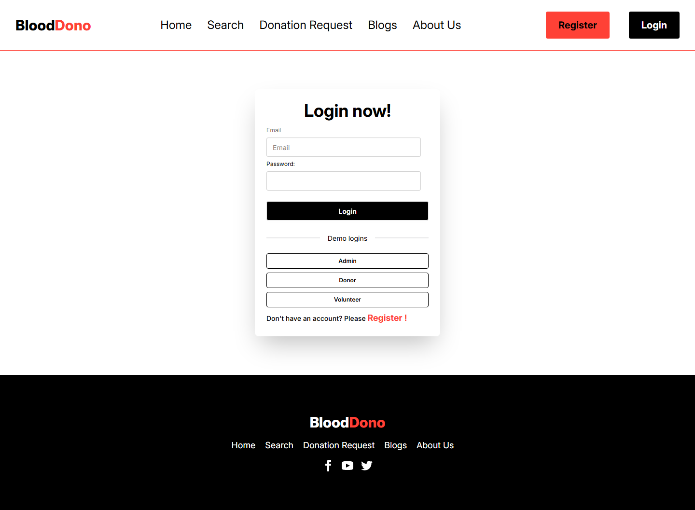
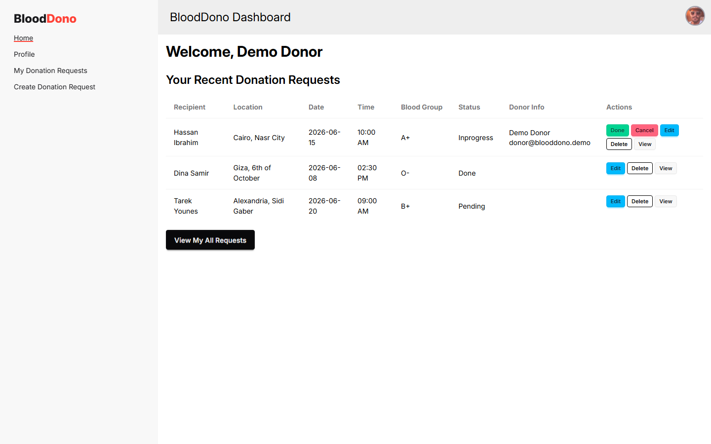

# BloodDono

A blood donation platform built with React, Vite, Tailwind CSS, and Supabase.

Donors and recipients can search for matches by blood group and location, post and manage donation requests, and get a role-based dashboard once they log in. Auth, profiles, and access control are backed by a real Supabase project (Postgres + Row Level Security), not mock data — so the admin/donor/volunteer experiences you see are driven by actual roles stored in the database.

🔗 **Live demo:** _link goes here after deploy_

## Try it yourself

The login page has one-click **Demo logins** for all three roles — no signup needed:

| Role | Email | Password |
|---|---|---|
| Admin | `admin@blooddono.demo` | `Demo123!` |
| Donor | `donor@blooddono.demo` | `Demo123!` |
| Volunteer | `volunteer@blooddono.demo` | `Demo123!` |

Each role sees a different dashboard — admin gets user/content management and platform-wide stats, donors get their own donation requests, and volunteers get a scoped-down view. Try `/dashboard/all-users` as the donor account to see the route guard kick in and redirect to `/forbidden`.

## Features

- Search for donors by blood group, governorate, and city
- View, create, and manage blood donation requests
- Real authentication with Supabase (sign up, log in, persistent sessions)
- Role-based dashboard (admin, donor, volunteer) backed by Postgres + Row Level Security
- Route guards that redirect unauthorized roles to a `/forbidden` page
- Blog section with a content management UI
- Donation/funding page
- Responsive layout with Tailwind CSS + DaisyUI

## Screenshots

| Home | Login (Demo logins) |
|---|---|
|  |  |

| Search Donors | Donation Requests |
|---|---|
|  |  |

| Admin Dashboard | Donor Dashboard |
|---|---|
|  |  |

## Tech Stack

**Frontend**
- React 19 + Vite
- Tailwind CSS 4 + DaisyUI 5
- React Router 7
- Redux Toolkit + React Redux
- React Hook Form
- SweetAlert2
- React Icons

**Backend**
- [Supabase](https://supabase.com/) — Postgres database, authentication, and Row Level Security

**Testing**
- Playwright (end-to-end)

## Getting Started

```bash
npm install
cp .env.example .env
```

Fill in `.env` with your Supabase project's URL and anon key:

```
VITE_SUPABASE_URL=your-project-url
VITE_SUPABASE_ANON_KEY=your-anon-key
```

Then start the dev server:

```bash
npm run dev
```

Runs at `http://localhost:5173`.

## Backend Setup

If you want to run this against your own Supabase project (rather than just using the live demo above):

1. Create a new Supabase project and copy its URL + anon key into `.env`.
2. Run `supabase/schema.sql` **STEP 1** in the Supabase SQL editor. This creates the `profiles` table, enables Row Level Security, and sets up column-level grants so a user can update their own profile fields but can never change their own `role` — that's set server-side only.
3. Seed the three demo accounts:
   ```bash
   node --env-file=.env scripts/seed-demo-accounts.mjs
   ```
4. Run **STEP 2** of `supabase/schema.sql` to promote the admin and volunteer demo accounts to their roles (the donor account keeps the default `role`).

## Testing

End-to-end tests use [Playwright](https://playwright.dev/) and cover navigation, authentication (including the demo logins), and role-based access control.

```bash
npm run test:e2e
```

This starts the dev server automatically and runs the suite against Chromium.

## Deployment

Deployed on [Vercel](https://vercel.com/) — `vercel.json` handles the SPA rewrite so client-side routes work on refresh and direct links. Set `VITE_SUPABASE_URL` and `VITE_SUPABASE_ANON_KEY` as environment variables in the Vercel project settings.
