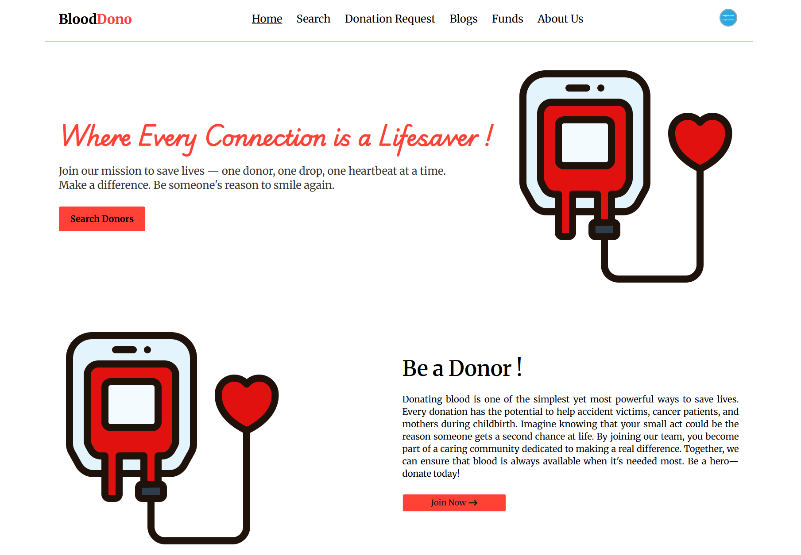
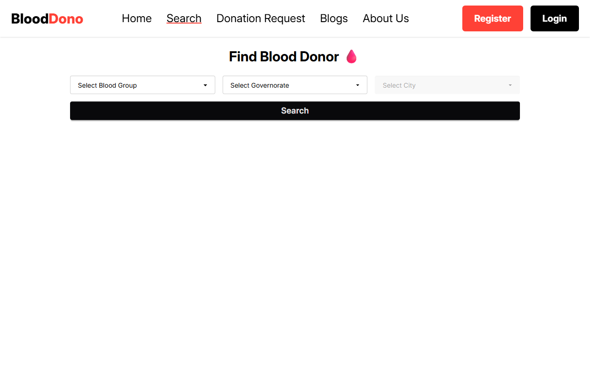
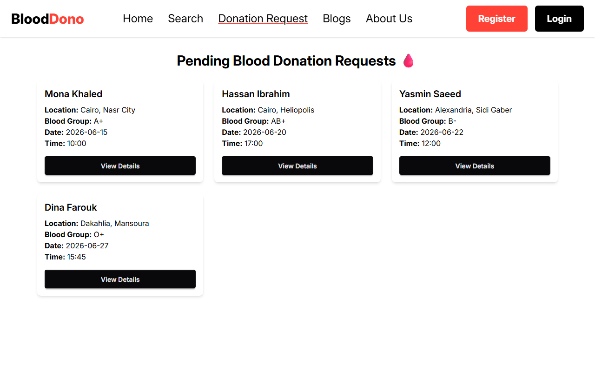
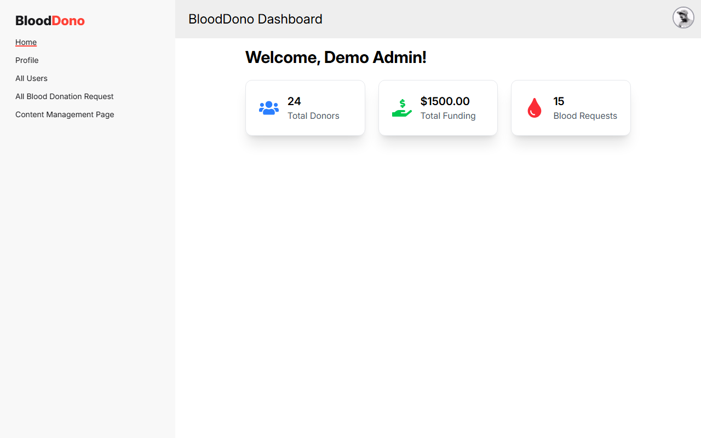

# BloodDono

A frontend UI portfolio project for a blood donation platform, built with React, Vite, Tailwind CSS, and DaisyUI.

This project focuses purely on the user interface — donor search, blood donation requests, a role-based dashboard, and a simple blog/content section. All data shown is local sample data, so the app runs fully offline with no backend or database required.

## Features

- Browse and search for blood donors by blood group, district, and city
- View and create blood donation requests
- Role-based dashboard layout (admin / donor views)
- Blog section with a content management UI
- Simple donation/funding page
- Fully responsive design with Tailwind CSS and DaisyUI

## Screenshots

| Home | Search Donors |
|---|---|
|  |  |

| Donation Requests | Dashboard |
|---|---|
|  |  |

## Tech Stack

- React 19
- Vite
- Tailwind CSS 4 + DaisyUI 5
- React Router 7
- React Hook Form
- SweetAlert2
- React Icons

## Getting Started

```bash
npm install
npm run dev
```

The app will be available at `http://localhost:5173`.

## Notes

This is a UI-only demo project. The login and register pages are included for layout purposes — all pages use a demo user and sample data instead of a real backend.

---

Built by Amro Gad as a frontend portfolio project.
