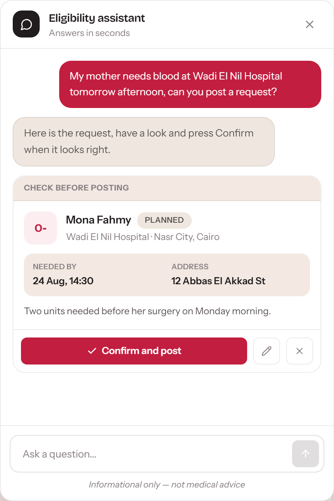
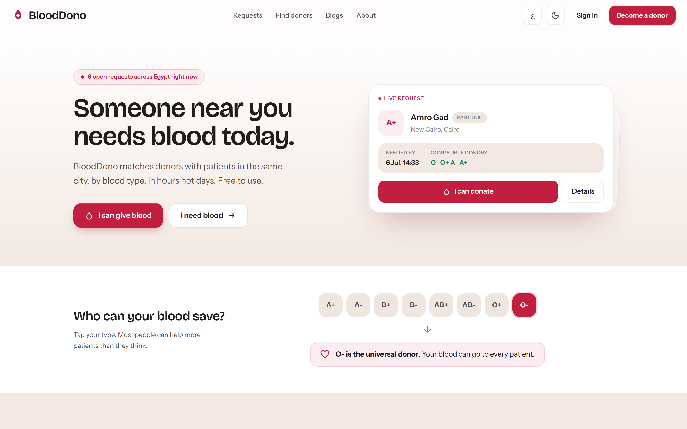
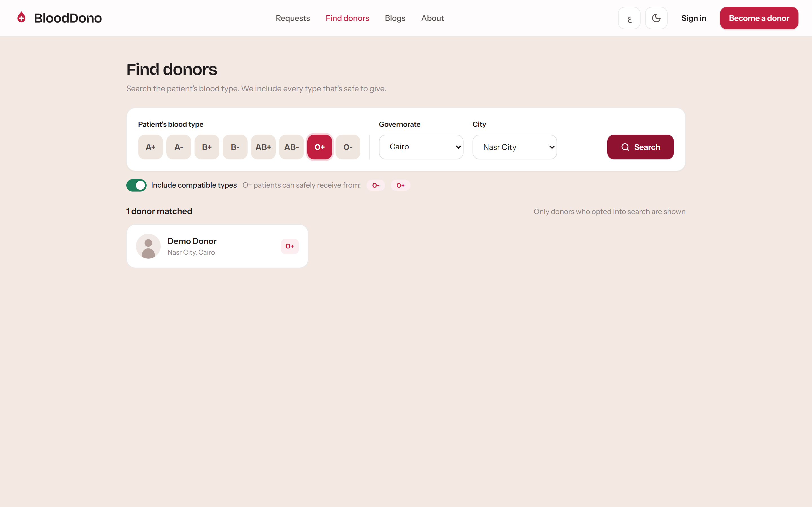
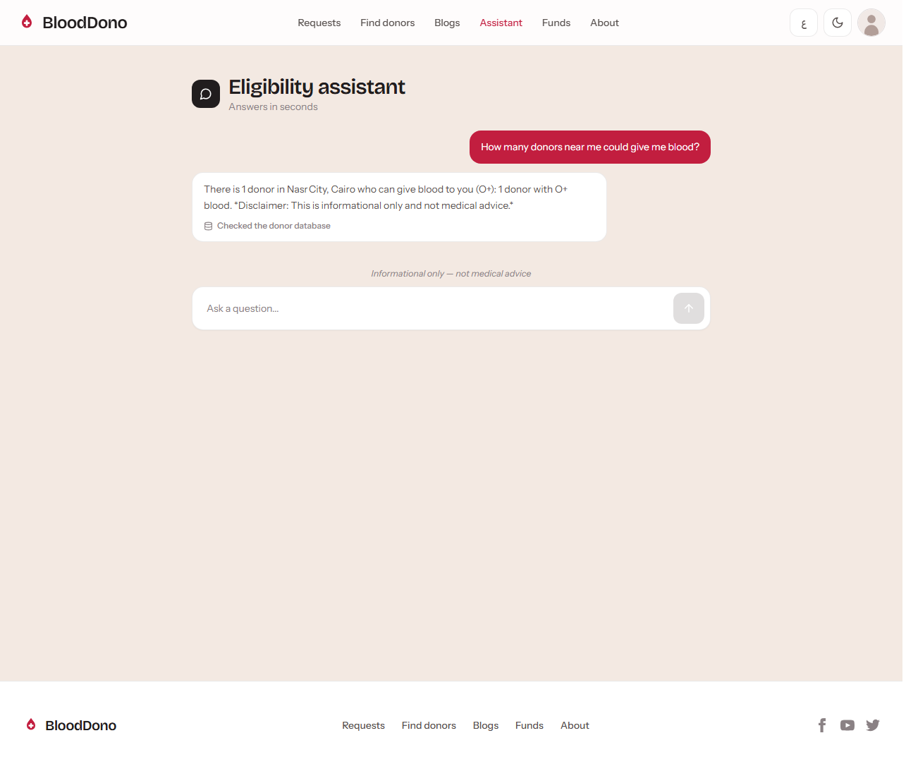
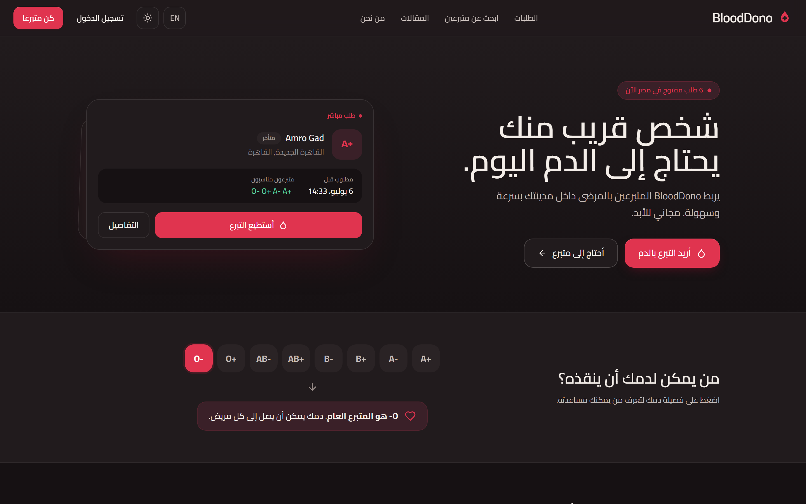

# BloodDono

Connects blood donors with the patients who need them, matched by blood-type compatibility and city. A React web app on a Supabase backend, in English or Arabic with the layout mirroring to full RTL.

[Live demo](https://blooddono-two.vercel.app/) · [Mobile app](https://github.com/amrogad/blooddono-mobile)

[](https://github.com/amrogad/blooddono/actions/workflows/ci.yml)

## The assistant posts requests, it isn't just a chat box

Tell it in plain language that someone needs blood and it builds a complete donation request from the conversation, then hands you a card to check. It never writes to the database on its own: the request is inserted only when you press Confirm, under your own permissions.



It answers eligibility questions too, and for availability like "who can donate to A+?" it runs a real query against the donor table instead of guessing a number. Two database-backed tools drive it, both server-side in a Supabase Edge Function so the Groq key never reaches the browser:

- `find_compatible_donors` looks up real availability by blood-type compatibility and city, and sends the model only aggregated counts, never donor names or photos
- `draft_donation_request` returns a validated draft; only your confirmation turns it into a row

The assistant has its own 19-case eval. An early 40% score exposed a real compatibility mistake, so I moved the compatibility rules out of the model's prompt and into the same source of truth the app uses.

## Also here

- Blood compatibility matching, so a search for an A+ patient also surfaces the O+ and O- donors who can safely give
- Role-based access for users and admins, enforced by route guards that redirect rather than hide links, so editing the URL by hand gets you nowhere
- English and Arabic from one component tree, mirroring to RTL with logical properties instead of a second stylesheet, switchable without a reload
- One Supabase project and edge functions shared with the React Native app, so a request posted on either shows up on the other

## Screenshots

| Home | Find donors |
|---|---|
|  |  |

| Assistant | Arabic, dark, RTL |
|---|---|
|  |  |

## Try it

One-click demo logins on the login page, no signup:

| Role | Email | Password |
|---|---|---|
| User | `donor@blooddono.demo` | `Demo123!` |
| Admin | `admin@blooddono.demo` | `Demo123!` |

## Known limitations

- New requests show up on refresh, not live. The feed is served through a name-masking function rather than a direct table read, and Supabase Realtime follows the same row-level security, so live updates would need a broadcast layer rather than a plain subscription.
- Payments on the funding page are recorded, not processed. There is no payment provider behind the card form.
- The assistant drafts a request but never submits or accepts one for you. Both commit you to something, so they stay behind a deliberate tap.

## Stack

Frontend: React 19, Vite, Tailwind CSS 4, DaisyUI 5, React Router 7, Redux Toolkit, React Hook Form, react-i18next.

Backend, as a managed service: Supabase for hosted auth, PostgreSQL, storage and Edge Functions (Deno), with Groq (`openai/gpt-oss-20b`) called server-side so the key never reaches the browser.

Testing and delivery: 59 Vitest and Testing Library tests, 24 Playwright end-to-end covering auth, role-based access and the Arabic switch. Lint, build and both test suites run on every push through GitHub Actions, deployed on Vercel.

## Run it

```bash
npm install
cp .env.example .env   # add your Supabase URL and anon key
npm run dev            # http://localhost:5173
```

```bash
npm test           # component tests
npm run test:e2e   # end-to-end
```
