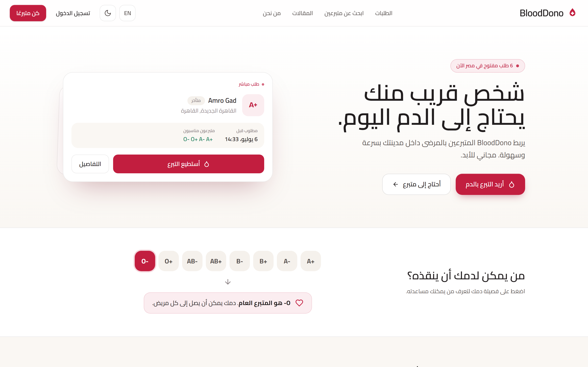
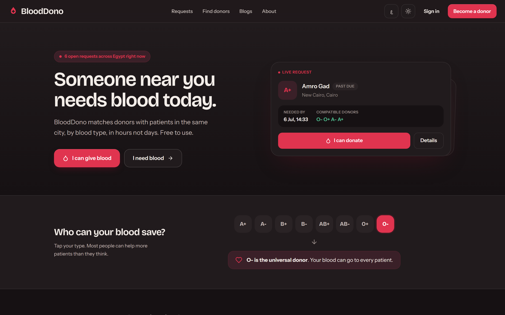
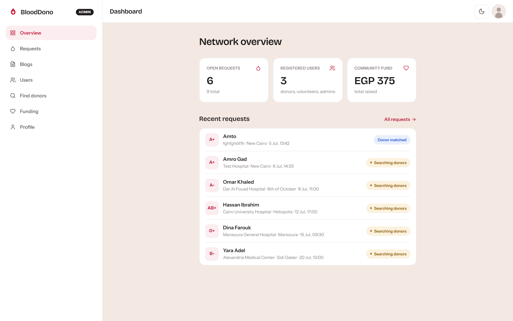
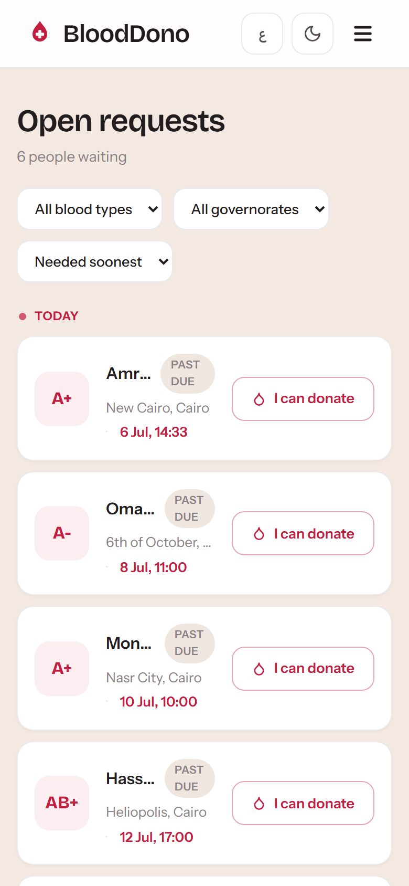
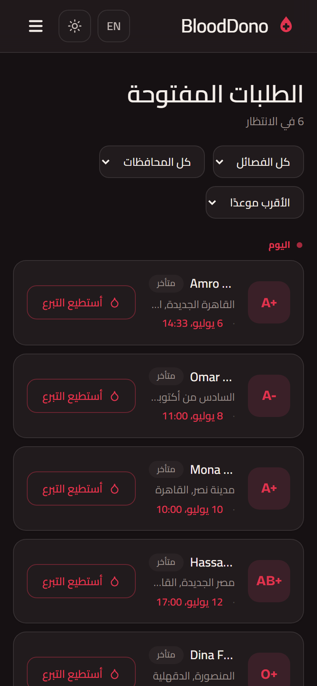

# BloodDono

A React web app that connects blood donors with the patients who need them. Donors search for matches by blood group and governorate, post and track requests through a role-based dashboard, and everything runs on real Supabase accounts instead of mock data. The whole interface works in English and Arabic, and the layout mirrors to full RTL when you switch.

There's also a [React Native version](https://github.com/amrogad/blooddono-mobile) on the same Supabase backend, so the data lines up across both.

🔗 **Live demo:** [blooddono-two.vercel.app](https://blooddono-two.vercel.app/)

## Highlights

- 🔐 Real authentication with role-based access for admins, donors, and volunteers
- 🛡️ Protected routes that redirect unauthorized roles to a forbidden page
- 🩸 Donor search by blood group and location, with compatibility matching
- 📝 Donation request management through a 3-step create wizard
- 🌐 Full Arabic and English support, with the layout mirroring to RTL on switch
- 🌙 Dark and light mode, system-aware and persisted
- 📱 Responsive across phone, tablet, and desktop

## Demo accounts

The login page has one-click demo logins for all three roles, no signup needed:

| Role | Email | Password |
|---|---|---|
| Admin | `admin@blooddono.demo` | `Demo123!` |
| Donor | `donor@blooddono.demo` | `Demo123!` |
| Volunteer | `volunteer@blooddono.demo` | `Demo123!` |

Each role opens a different dashboard: admins manage users, content, and platform-wide stats; donors see and manage their own requests; volunteers get a scoped coordinator view. Sign in as the donor and open `/dashboard/all-users` to watch the route guard redirect you to the forbidden page.

## Demo walkthrough

Under 3 minutes to see the core loop:

1. Log in with the Donor demo account.
2. Browse open requests, grouped by how soon blood is needed.
3. Open a request to see the patient details and which blood types can safely donate.
4. Post your own request through the 3-step wizard.
5. Go to Find Donors, pick a blood group and governorate, and see who can help.
6. Switch to the Admin or Volunteer demo account to see the other dashboards.
7. Tap ع in the top bar and watch the whole app flip to Arabic and RTL.

## Features

- Search for donors by blood group, governorate, and city
- Blood compatibility matching, so a search for A+ also surfaces the O+ and O- donors who can safely give
- Browse open requests grouped into Today, This week, and Later, with urgency labels
- Post, edit, and manage requests through a role-based dashboard
- Real authentication with Supabase: sign up, log in, and persistent sessions
- Role-aware routing with guards that redirect unauthorized roles to a forbidden page
- Blog section with a content management UI for drafting, publishing, and editing posts
- Community fund page where anyone can contribute, with a running list of donations
- Arabic and English with automatic RTL mirroring, switchable without leaving the page
- Dark and light themes, system-aware and persisted

## Screenshots

The home page in every combination of language and theme:

| English · light | Arabic · light (RTL) |
|---|---|
|  |  |

| English · dark | Arabic · dark (RTL) |
|---|---|
|  |  |

A couple more screens, plus the mobile layout:

| Find donors | Admin dashboard |
|---|---|
|  |  |

| Mobile · English | Mobile · Arabic (dark, RTL) |
|---|---|
|  |  |

## Architecture

```
UI (React + React Router)
        ↓
Redux Toolkit (auth)  ·  React Context (theme + locale)
        ↓
Service layer (Supabase queries and RPCs)
        ↓
Supabase (PostgreSQL · Auth · Storage)
```

## Built with

- 45+ React components and pages
- 59 automated tests (Vitest + Playwright)
- Shared Supabase backend with the mobile version
- Deployed on Vercel, green on CI

## Tech stack

### Frontend
- React 19 + Vite
- Tailwind CSS 4 + DaisyUI 5
- React Router 7
- Redux Toolkit + React Redux
- React Hook Form
- react-i18next for Arabic and English with RTL
- SweetAlert2
- React Icons

### Backend (managed service)
- [Supabase](https://supabase.com/) for hosted authentication, PostgreSQL, and storage

### Testing
- Vitest + Testing Library (component)
- Playwright (end-to-end)

## Testing

The full pipeline runs on every push through GitHub Actions: lint, build, component tests, then end-to-end.

Component tests use Vitest and Testing Library:

```bash
npm test
```

End-to-end tests use Playwright and cover navigation, auth flows, role-based access, and the Arabic RTL switch:

```bash
npm run test:e2e
```

59 tests in total, including a parity check that every English string has an Arabic translation.

## Why I built this

Blood shortages are a logistics problem: patients need specific types, donors are willing, but there's no fast way to connect the two. I wanted something real end to end rather than a toy demo, so it has genuine auth and access control, blood-type compatibility matching, and a fully bilingual Arabic and English interface with RTL.

## Getting started

```bash
npm install
cp .env.example .env
```

Fill in `.env` with your Supabase project's URL and anon key:

```
VITE_SUPABASE_URL=your-project-url
VITE_SUPABASE_ANON_KEY=your-anon-key
```

Then start the dev server:

```bash
npm run dev
```

Runs at `http://localhost:5173`.

## Deployment

Deployed on [Vercel](https://vercel.com/). `vercel.json` handles the SPA rewrite so client-side routes survive a refresh or a direct link. Set `VITE_SUPABASE_URL` and `VITE_SUPABASE_ANON_KEY` in the Vercel project's environment variables.

## Project structure

```
src/
├── auth/            AuthProvider + route guards (PrivateRoute, AdminRoute, MultiRoleRoute)
├── components/      NavBar, RequestCard, BloodRoundel, Pills, LanguageToggle, ThemeToggle, ...
├── layouts/         Root shell + DashboardLayout
├── pages/           home, auth, blogs, search, requests, funding, dashboard (donations + content)
├── providers/       ThemeProvider, LocaleProvider
├── services/        Supabase queries and RPCs (auth, profiles, donations, blogs, funds)
├── redux/           auth slice + store
├── locales/         en.json + ar.json
├── utils/           urgency, blood compatibility, place names, slugs
└── assets/          governorates + cities
```
